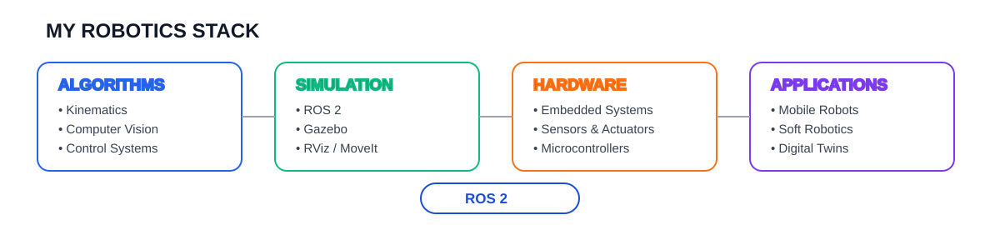

<p align="center">
  
</p>

<p align="center">
  <a href="https://github.com/devwithchai">GitHub</a>
  &nbsp;·&nbsp;
  <a href="https://www.linkedin.com/in/chaitanya-belekar/">LinkedIn</a>
</p>

---

## My Robotics Stack

<p align="center">
  
</p>

---

## Currently Building

| Project | Status |
|---|---|
| **[OpenKinematics](https://github.com/devwithchai/OpenKinematics)** | 🔵 Building |
| **Tendon-Driven Soft Robotic Finger** | 🟢 Exploring |
| **Mobile Robotics with ROS 2** | 🟠 Building |
| **Digital Twin for Robotic Systems** | 🟣 Planning |

### OpenKinematics

A Python library for **robot kinematics, dynamics and visualization**, implemented from first principles.

The project started as a way to understand robot mathematics more deeply rather than simply relying on existing tools.

→ [View repository](https://github.com/devwithchai/OpenKinematics)

### Tendon-Driven Soft Robotic Finger

Exploring tendon-driven actuation, soft robotic mechanisms and dynamic simulation.

The goal is to understand the complete chain:

`mechanism → actuation → modelling → simulation → control`

### Mobile Robotics

Working with differential-drive robots, embedded controllers, sensors and ROS 2.

The direction is moving from basic physical prototypes toward:

`embedded systems → odometry → sensor fusion → ROS 2 → autonomy`

---

## Selected Work

<table>
<tr>
<td width="33%" valign="top">

### OpenKinematics

Python-based robotics library for:

- Kinematics
- Dynamics
- Visualization
- Mathematical modelling

**Python · Robotics**

→ [Repository](https://github.com/devwithchai/OpenKinematics)

</td>

<td width="33%" valign="top">

### Soft Robotics

Tendon-driven soft robotic finger exploring:

- Actuation
- Mechanism design
- Dynamic simulation
- Soft robotics

**CAD · Simulation · Robotics**

→ Project in progress

</td>

<td width="33%" valign="top">

### Mobile Robotics

ROS 2 based mobile robotics work involving:

- Differential drive
- Sensors
- Embedded control
- Robot simulation

**ROS 2 · Embedded · Gazebo**

→ Project in progress

</td>
</tr>
</table>

---

## From the Workbench

```text
08 / 2026   → experimenting with tendon-driven soft robotics
07 / 2026   → building and documenting OpenKinematics
06 / 2026   → working deeper with ROS 2 and robot simulation
05 / 2026   → exploring robotics algorithms and system design
```

This section will probably change often.

That's the point.

---

## Tools & Languages

**Languages**

`Python` `C` `C++` `MATLAB`

**Robotics**

`ROS 2` `Gazebo` `RViz` `MoveIt`

**Engineering**

`Fusion 360` `Embedded Systems` `Robot Simulation`

**Tools**

`Linux` `Git` `GitHub` `Arduino` `ESP32`

---

## What I'm Interested In

```text
Robotics Software
       │
       ├── Robot Kinematics & Dynamics
       ├── ROS 2
       ├── Computer Vision
       ├── Reinforcement Learning
       ├── Digital Twins
       ├── Embedded Robotics
       └── Human–Robot Interaction
```

I'm especially interested in the space where

**mathematics → algorithms → simulation → hardware**

meet each other.

---

## A small note

Not everything here is finished.

Some repositories are polished.  
Some are experiments.  
Some are ideas I'm still trying to figure out.

I prefer documenting the process rather than waiting until everything looks perfect.

---

<p align="center">

`< Keep building. Keep learning. Share everything. />`

</p>
