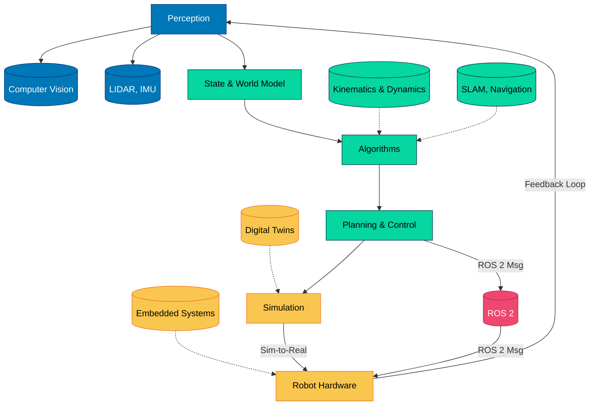

# Chaitanya Belekar

  

  
  &nbsp;
  
  &nbsp;
  

---

## How I Build

I usually understand things better after trying to build them.

A derivation becomes clearer when it drives a simulation.  
A simulation becomes more interesting when it meets hardware.

That's the loop I keep coming back to:

**understand → build → break → improve → document**

---

## Currently Building

<table>
<tr>
<td width="50%" valign="top">

### OpenKinematics

A Python library for **robot kinematics, dynamics and visualization**, implemented from first principles.

Built mainly as a way to understand the mathematics behind robotics more deeply.

→ [View repository](https://github.com/devwithchai/OpenKinematics)

</td>
<td width="50%" valign="top">

### Mobile Robotics

Working with differential-drive robots, embedded controllers, sensors and ROS 2.

Moving from physical prototypes toward:

`odometry → sensor fusion → ROS 2 → autonomy`

→ [View repository](https://github.com/devwithchai/MobileRobotics)

</td>
</tr>
<tr>
<td width="50%" valign="top">

### Tendon-Driven Soft Robotic Finger

Exploring tendon-driven actuation, soft robotic mechanisms and dynamic simulation.

The current chain is:

`mechanism → actuation → modelling → simulation → control`

</td>
<td width="50%" valign="top">

### Digital Twins

Exploring how simulation, robot models and real-world data can come together to represent robotic systems.

</td>
</tr>
</table>

---

## Toolbox

Instead of a wall of badges, here's how the tools fit into the way I work:

| Layer | Tools I use | What they help me do |
|:--|:--|:--|
| **Code** |     | algorithms, modelling, control |
| **Robot OS** |    | connect and develop robotic systems |
| **Simulation** |    | test robots before hardware |
| **Hardware** |     | turn models into physical systems |
| **Design** |   | mechanisms and robot structures |

<b>Current technical focus</b>

 

`Robot Kinematics` · `Computer Vision` · `Control Systems` · `ROS 2` · `Robot Simulation` · `Embedded Robotics` · `Soft Robotics` · `Digital Twins`

---

## What I'm Exploring

I don't think of these as separate technologies. I'm interested in how they form one robotic system:

The interesting part for me is the loop:

**sense → understand → decide → simulate → act → learn**

That's where mathematics, algorithms, software and physical robotics start meeting each other.

---

## A Small Note

Not everything here is finished.

Some repositories are polished.  
Some are experiments.  
Some are ideas I'm still trying to figure out.

I prefer documenting the process rather than waiting until everything looks perfect.

---

`< Keep building. Keep learning. Share everything. />`

